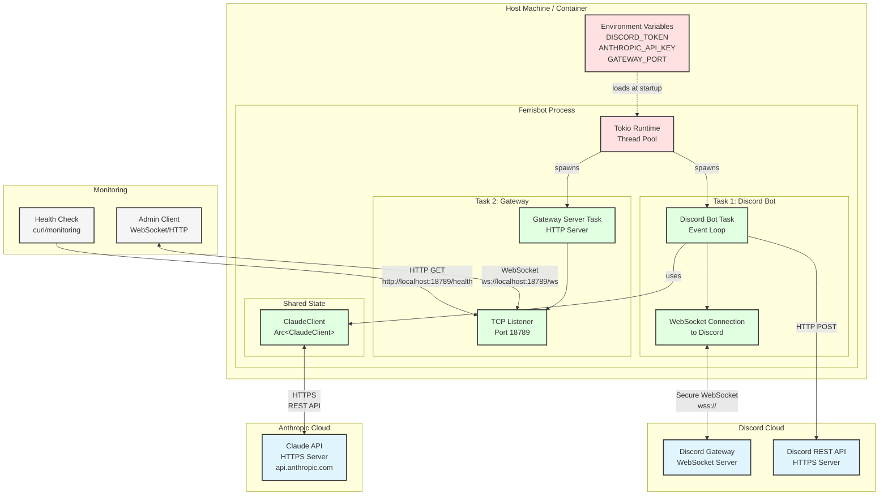

# Deployment Architecture

Runtime deployment view of Ferrisbot.



## Deployment Components

### External Services

**Discord Cloud:**
- Gateway: WebSocket for real-time events
- REST API: Message sending, channel operations

**Anthropic Cloud:**
- Claude API: HTTPS REST for completions

### Host Environment

**Process:**
- Single Rust binary: `ferrisbot`
- Tokio runtime: Multi-threaded async executor
- Shared memory: Arc for ClaudeClient

**Configuration:**
- Environment variables only
- No config files
- Secrets never in code/git

### Runtime Tasks

**Task 1 - Discord Bot:**
- Maintains WebSocket connection
- Handles incoming message events
- Makes HTTP requests to Claude
- Posts replies via Discord REST API

**Task 2 - Gateway:**
- Binds TCP listener on port 18789
- Serves HTTP health checks
- Upgrades to WebSocket for monitoring
- Independent of Discord task

### Monitoring Points

**Health Check:**
- `GET /health` → 200 OK
- No authentication required
- Used by load balancers/monitoring

**WebSocket Control:**
- `ws://host:18789/ws`
- JSON protocol
- Real-time status updates

## Deployment Options

### Option 1: Direct Execution
```bash
export DISCORD_TOKEN="..."
export ANTHROPIC_API_KEY="..."
./ferrisbot
```

### Option 2: Docker
```dockerfile
FROM rust:1-slim
WORKDIR /app
COPY target/release/ferrisbot .
ENV GATEWAY_PORT=18789
EXPOSE 18789
CMD ["./ferrisbot"]
```

### Option 3: Kubernetes
```yaml
apiVersion: apps/v1
kind: Deployment
metadata:
  name: ferrisbot
spec:
  replicas: 1
  template:
    spec:
      containers:
      - name: ferrisbot
        image: ferrisbot:latest
        env:
        - name: DISCORD_TOKEN
          valueFrom:
            secretKeyRef:
              name: ferrisbot-secrets
              key: discord-token
        - name: ANTHROPIC_API_KEY
          valueFrom:
            secretKeyRef:
              name: ferrisbot-secrets
              key: claude-api-key
        ports:
        - containerPort: 18789
        livenessProbe:
          httpGet:
            path: /health
            port: 18789
```

### Option 4: systemd Service
```ini
[Unit]
Description=Ferrisbot Discord Bot
After=network.target

[Service]
Type=simple
User=ferrisbot
EnvironmentFile=/etc/ferrisbot/config.env
ExecStart=/usr/local/bin/ferrisbot
Restart=always

[Install]
WantedBy=multi-user.target
```

## Resource Requirements

**MVP (v0.1.0):**
- CPU: <5% idle, spikes to 20-30% during messages
- Memory: 50-100 MB
- Network: Minimal (event-driven)
- Disk: None (stateless)

**Scaling Considerations (v0.2.0+):**
- Database for conversation history
- Redis for caching/rate limiting
- Multiple instances behind load balancer (future)

## Security Notes

1. **Secrets**: Never in code, always env vars
2. **TLS**: Discord and Claude use HTTPS/WSS
3. **Gateway**: No authentication in MVP (add in v0.6.0)
4. **Firewall**: Only port 18789 needs to be open
5. **Updates**: Keep dependencies updated (cargo-audit)

## Related

- ADR-008: Environment-Based Configuration
- ADR-006: Tokio Runtime
- [System Architecture](./system-architecture.md) for logical view
