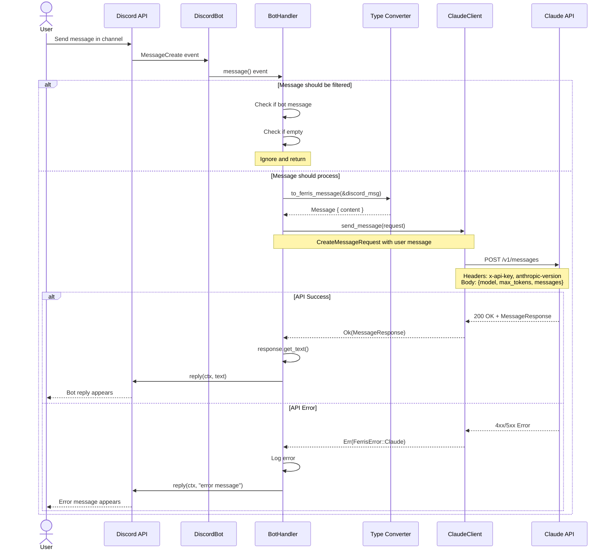

# Message Flow Sequence

End-to-end flow of a Discord message through Ferrisbot to Claude and back.

## Flow Description

### 1. Message Reception
1. User types message in Discord channel
2. Discord sends MessageCreate event via WebSocket
3. Serenity client receives and routes to BotHandler

### 2. Filtering
1. Handler checks `should_process_message()`
2. Filters bot messages (prevent infinite loops)
3. Filters empty messages
4. If filtered, returns early

### 3. Type Conversion
1. Convert Discord `Message` to internal `Message` type
2. Extract content string
3. Remove Discord-specific metadata

### 4. Claude API Call
1. Build `CreateMessageRequest` with user message
2. ClaudeClient sends HTTPS POST
3. Includes authentication headers
4. Waits for response (async)

### 5. Response Handling

**Success Path:**
1. Parse `MessageResponse` JSON
2. Extract text from content blocks
3. Send Discord reply with Claude's response

**Error Path:**
1. Log error with context
2. Send user-friendly error message
3. Don't crash bot

## Timing

Typical latencies (production):
- Discord → Bot: <100ms (WebSocket)
- Bot processing: <10ms (filtering + conversion)
- Claude API: 1-3 seconds (varies by response length)
- Bot → Discord: <200ms (REST API)

**Total user experience**: 1.5-3.5 seconds from send to reply

## Error Handling

Errors are caught at every level:
- Discord connection errors → Auto-reconnect
- Filter errors → Skip message
- Claude API errors → User-friendly message
- Discord reply errors → Logged, not retried

## Related

- ADR-002: Strict TDD (all flows tested)
- ADR-005: Single Error Type (unified error handling)
- [State Machine](./state-machine.md) for detailed state transitions
