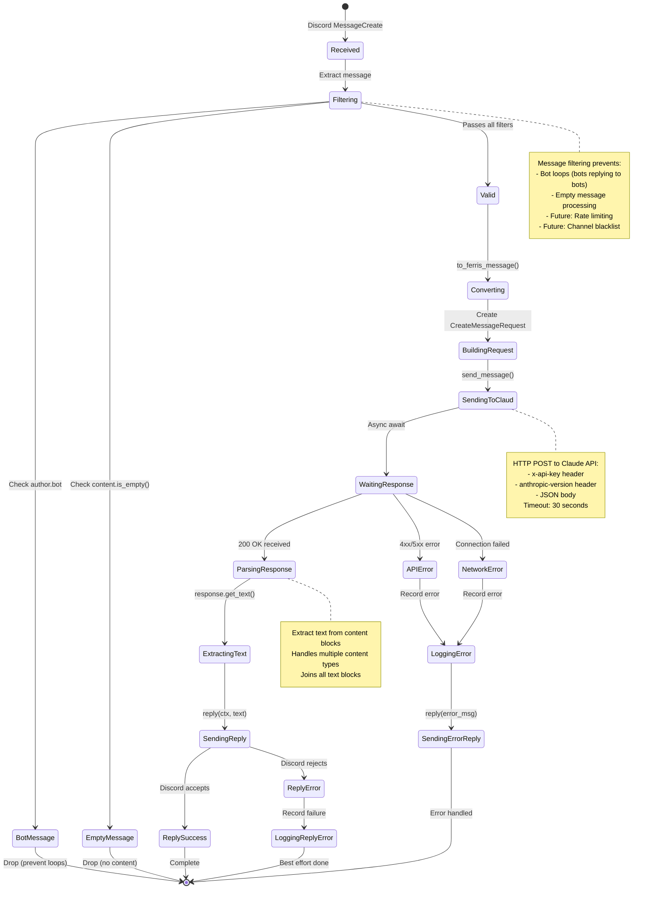

# Message Processing State Machine

State transitions for processing a Discord message through Ferrisbot.

## State Descriptions

### Initial States

**Received**
- Discord WebSocket event arrives
- Serenity deserializes to Message type
- Handler.message() called

**Filtering**
- Check if message from bot (`author.bot`)
- Check if content is empty
- Future: Rate limit check, channel check

**Valid**
- Message passed all filters
- Ready for processing

### Processing States

**Converting**
- Discord Message → Internal Message
- Extracts content string
- Discards Discord metadata

**BuildingRequest**
- Create CreateMessageRequest
- Wrap message as user role
- Set model and parameters

**SendingToClaud**
- HTTP POST to Anthropic API
- Async operation begins
- Timeout: 30 seconds

**WaitingResponse**
- Awaiting HTTP response
- Can timeout or error

### Success Path

**ParsingResponse**
- JSON deserializes to MessageResponse
- Validates structure
- Extracts metadata

**ExtractingText**
- Calls response.get_text()
- Joins content blocks
- Produces reply string

**SendingReply**
- Calls msg.reply(ctx, text)
- Discord API call
- Async operation

**ReplySuccess**
- Discord confirmed delivery
- Message visible to user
- Processing complete

### Error Paths

**APIError**
- Claude API returned 4xx/5xx
- Extract error message
- Log with context

**NetworkError**
- Connection failed
- Timeout occurred
- DNS issues, etc.

**ReplyError**
- Discord API rejected reply
- Permissions issue
- Channel deleted, etc.

**LoggingError**
- Record error via tracing
- Don't crash bot
- Notify user if possible

## State Transitions Table

| From | To | Condition |
|------|-----|-----------|
| Received | Filtering | Always |
| Filtering | BotMessage | author.bot == true |
| Filtering | EmptyMessage | content.is_empty() |
| Filtering | Valid | Passes filters |
| Valid | Converting | Always |
| Converting | BuildingRequest | Always |
| BuildingRequest | SendingToClaud | Always |
| SendingToClaud | WaitingResponse | Always |
| WaitingResponse | ParsingResponse | 200 OK |
| WaitingResponse | APIError | 4xx/5xx |
| WaitingResponse | NetworkError | Connection issue |
| ParsingResponse | ExtractingText | Always |
| ExtractingText | SendingReply | Always |
| SendingReply | ReplySuccess | Discord OK |
| SendingReply | ReplyError | Discord error |
| APIError | LoggingError | Always |
| NetworkError | LoggingError | Always |
| LoggingError | SendingErrorReply | Always |
| SendingErrorReply | [*] | Always |
| ReplySuccess | [*] | Always |
| ReplyError | LoggingReplyError | Always |
| LoggingReplyError | [*] | Always |

## Error Handling Philosophy

1. **Never crash**: Errors are logged and handled
2. **User feedback**: Send error message when possible
3. **Fail gracefully**: Skip message if unrecoverable
4. **Log everything**: All errors traced for debugging
5. **No retries** (MVP): Future enhancement

## Future States (v0.2.0+)

Additional states planned:
- **LoadingContext**: Fetch conversation history from DB
- **CheckingRateLimit**: Per-user rate limit check
- **Streaming**: Progressive response updates
- **UsingTools**: Tool execution loop
- **AgentHandoff**: Multi-agent coordination

## Related

- ADR-005: Single Error Type (unified error handling)
- [Message Flow](./message-flow.md) for sequence diagram
- Handler implementation: `src/discord/handler.rs`
