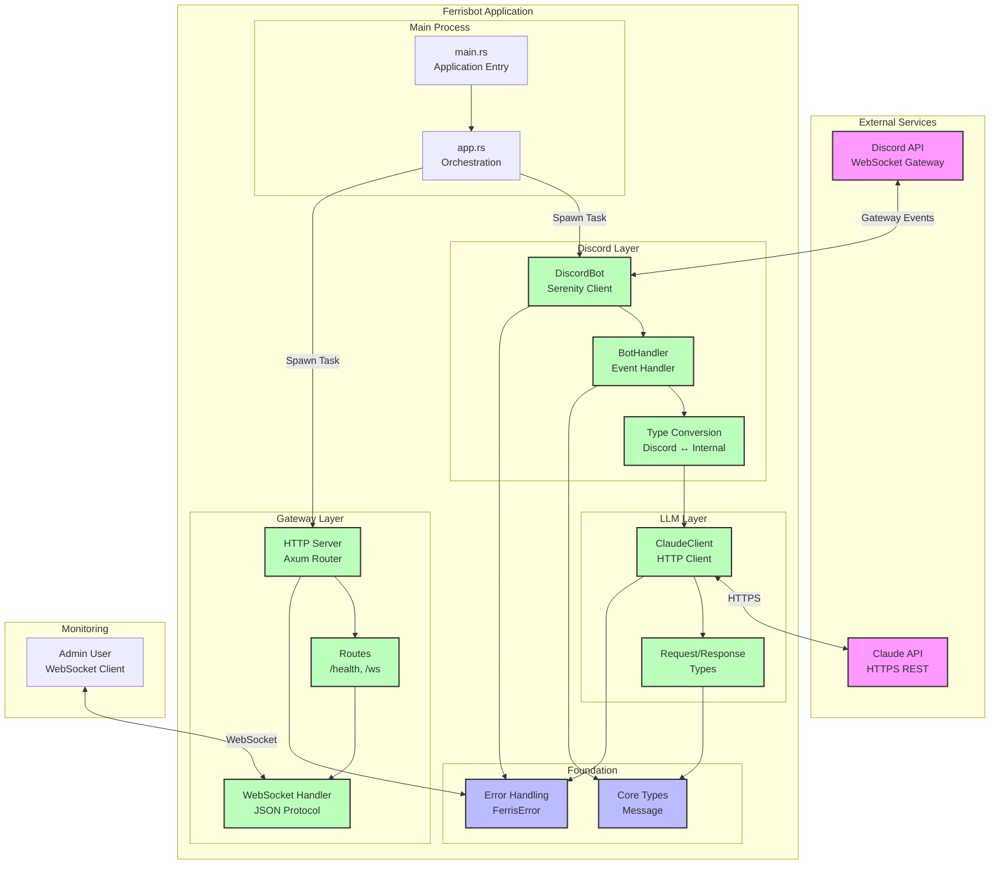

# System Architecture

Overall architecture of Ferrisbot v0.1.0 MVP.

## Description

**External Services:**
- **Discord API**: WebSocket gateway for real-time events
- **Claude API**: HTTPS REST API for AI completions

**Main Process:**
- **main.rs**: Application startup and configuration loading
- **app.rs**: Orchestrates Discord bot and gateway server as concurrent tasks

**Discord Layer** (Serenity):
- **DiscordBot**: Manages connection lifecycle and configuration
- **BotHandler**: Implements EventHandler trait for message events
- **Convert**: Transforms Discord types to internal Message types

**Gateway Layer** (Axum):
- **HTTP Server**: Serves health checks and WebSocket upgrades
- **Routes**: Defines /health and /ws endpoints
- **WebSocket Handler**: JSON protocol for monitoring and control

**LLM Layer** (Reqwest):
- **ClaudeClient**: HTTP client for Claude API
- **Request/Response Types**: Strongly-typed API messages

**Foundation**:
- **Core Types**: Shared domain types (Message)
- **Error Handling**: Unified error type (FerrisError)

## Key Design Decisions

1. **Concurrent Tasks**: Bot and Gateway run as separate Tokio tasks
2. **Shared Runtime**: All components use Tokio for async operations
3. **Type Safety**: Strong typing throughout with compile-time checks
4. **Layered Architecture**: Clear separation of concerns
5. **Foundation Types**: Shared error and message types reduce coupling

## Related

- ADR-007: Modular Architecture
- ADR-006: Tokio Runtime
- [Component Diagram](./components.md) for detailed module view
